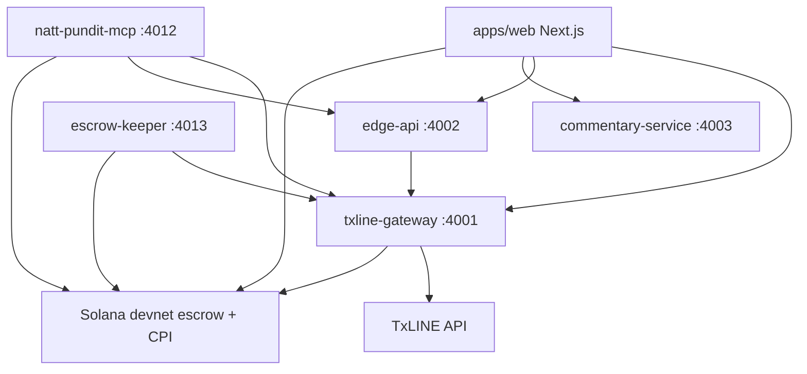

# Natt Settlement

[](./SECURITY.md) [](https://hypernatt.com/fr/nattpundit?lang=en)

**TxODDS World Cup — Prediction Markets & Settlement** track (Superteam). Live Shin consensus, SETUP/HOLD edge, Merkle settlement verification, devnet escrow pools, agent MCP.

> **Public mirror note:** This repo is synced from the private NATTAPP monorepo (`hackathon/natt-pundit/` via `scripts/sync-public-github.ps1`). Git history here is incremental mirror commits, not the full dev timeline. Proprietary edge engine stays off the public tree.

## In 20 seconds

**Natt Settlement** turns TxLINE World Cup data into **trustless Solana prediction-market settlement** (devnet USDC — not real money).

1. **TxLINE** streams odds and publishes a cryptographic match-result proof (Merkle).
2. Our **Anchor escrow** CPI-validates that proof on Solana devnet (`validate_stat`) — fail-closed if invalid.
3. A **permissionless keeper** settles finished pools (fee payer only); **users alone** sign deposit and USDC **claim**.

The backend is **not** the score oracle — **TxLINE is the verifiable source of truth**; the on-chain program enforces settlement.

> **Legal / demo scope:** Solana **devnet** only — **not real money**, not a licensed sportsbook or gambling product. USDC here is Circle test mint on devnet. This submission demonstrates a **verifiable settlement engine** for prediction-market research (TxODDS hackathon track). Users connect their own wallets; we do not custody fan funds.

### What we do NOT claim

| We do **not** claim | What we **do** show |
|---------------------|---------------------|
| Mainnet production sportsbook | Devnet parimutuel escrow + CPI settlement |
| Custody of user keys or USDC | User-signed deposit / claim; keeper fee-payer only on `settle` |
| Open-source edge formula (SETUP/HOLD) | Observable verdict badges + CLV harness in Data Lab |
| Multi-oracle consensus | Single TxLINE Merkle + CPI path (documented) |
| Multisig program upgrade (devnet) | Fast-iteration deployer key; multisig noted as prod requirement |

**Deep dive:** [`docs/TXLINE_SETTLEMENT.md`](./docs/TXLINE_SETTLEMENT.md) · On-chain program: [`../solana-escrow/`](../solana-escrow/)

## Start here

| Step | Link |
|------|------|
| **1. Quickstart (5 min)** | [`docs/QUICKSTART_JURY.md`](./docs/QUICKSTART_JURY.md) |
| **2. User guide** (bet, wallet, claim, MCP) | [`docs/USER_GUIDE.md`](./docs/USER_GUIDE.md) |
| **3. In-app manual (8 languages)** | https://hypernatt.com/fr/nattpundit?lang=en&tab=docs |
| **4. Live app (English UI)** | https://hypernatt.com/fr/nattpundit?lang=en |
| **5. Technical smoke** | [`docs/SUBMISSION_KIT.md`](./docs/SUBMISSION_KIT.md) |
| **5b. TxLINE API feedback** | [`docs/TXLINE_FEEDBACK.md`](./docs/TXLINE_FEEDBACK.md) |
| **6. TxLINE settlement (CPI)** | [`docs/TXLINE_SETTLEMENT.md`](./docs/TXLINE_SETTLEMENT.md) |
| **7. Cursor / MCP setup** | [`docs/CURSOR_NATT_PUNDIT_MCP.md`](./docs/CURSOR_NATT_PUNDIT_MCP.md) |
| **8. Autonomous agent (CDP)** | [`docs/AUTONOMOUS_AGENT_CDP.md`](./docs/AUTONOMOUS_AGENT_CDP.md) |
| **Anchor escrow (devnet)** | [`../solana-escrow/`](../solana-escrow/) — program `GPSU49hPRqWeEtTyMghWLWrXagV8hobFPkbFKVK3jxUD` |

**Devnet faucets:** [SOL](https://faucet.solana.com/) · [USDC](https://faucet.circle.com/) (Solana Devnet) · **MCP:** `https://hypernatt.com/mcp-pundit/protocol`

## Security

Pre-submission multi-layer audit (Anchor escrow, MCP Pundit server, x402 Solana protocol, nginx/RPC infra) — master plan [275_SECURITY_REMEDIATION_MASTER_PLAN.md](./docs/275_SECURITY_REMEDIATION_MASTER_PLAN.md): **17 findings** (**2** critical · **7** high · **6** medium · **1** low · **1** info). **All CRITICAL and HIGH closed** (devnet escrow `GPSU49…`, MCP Pundit, gateway/web). **F95N** (2026-07-10): removed `settle_knockout_tab` (no client-supplied penalty winner); ATA submit whitelist; RPC rate limit 60/min. **F96N keeper** (2026-07-13): settle-only worker + fan orchestrator tests — [AUDIT_F96N_KEEPER_SNAPSHOT.md](./docs/AUDIT_F96N_KEEPER_SNAPSHOT.md). Details: [SECURITY.md](./SECURITY.md). **Tests**: monorepo **228/228** PASS (MCP 50/50, keeper 5/5, fan orchestrator 5/5). Traceability: `9d9c95dd` (F95N escrow), `9ffd70ba` (rate-limit), `6dda3439` (submit guard).

| Check | Tool | Result (2026-07-12) |
|-------|------|---------------------|
| Packages (`contracts`, `natt-core`) | `npm audit --audit-level=high` | **PASS** — 0 vulnerabilities |
| MCP server (`@natt-pundit/mcp`) | `npm audit --audit-level=high --omit=dev` | **PASS** — 0 direct; 5 high transitive Solana SDK only (tracked) |
| Dependency scan (Snyk) | `snyk test` | **WAIVE** — requires `snyk auth` / `SNYK_TOKEN` (not available pre-submission) |
| Escrow program (devnet) | `cargo audit` + Sec3 X-Ray | **PASS** — see [`../solana-escrow/SECURITY.md`](../solana-escrow/SECURITY.md) |

| | |
|---|---|
| **Live app** | https://hypernatt.com/fr/nattpundit?lang=en |
| **Quickstart** | [`docs/QUICKSTART_JURY.md`](./docs/QUICKSTART_JURY.md) |
| **User guide** | [`docs/USER_GUIDE.md`](./docs/USER_GUIDE.md) |
| **In-app manual (8 langs)** | https://hypernatt.com/fr/nattpundit?lang=en&tab=docs |
| **MCP endpoint** | https://hypernatt.com/mcp-pundit/protocol |
| **Data Lab** | https://hypernatt.com/fr/nattpundit/datas?lang=en |
| **Hackathon** | [TxODDS World Cup — Prediction Markets & Settlement](https://superteam.fun/earn/listing/prediction-markets-and-settlement) — deadline **2026-07-19** |
| **TxLINE docs** | https://txline.txodds.com/documentation/worldcup |
| **Smoke kit** | [`docs/SUBMISSION_KIT.md`](docs/SUBMISSION_KIT.md) |

---

## What it does

- **2D dashboard**: WC fixtures, live odds (TxLINE), scores, SETUP/HOLD badges
- **i18n (8 languages)**: **en, fr, es, zh, ja, ru, pt, de** — full fan journey (fixtures, match detail, bet slip, wallet, in-app docs, agent connect); header switch + `?lang=` URL
- **Light/dark mode**: Stitch glass theme toggle (top-left); persists locally; **Reown wallet modal** syncs theme; night stadium art in dark mode
- **Edge**: two-source combine vs Shin consensus `pi_tx`; **SETUP** only when net disagreement exceeds a pre-registered threshold (else **HOLD**)
- **Settlement**: TxLINE stat-validation Merkle proofs verified off-chain (SHA-256, sibling order); on-chain CPI `validate_stat` on devnet escrow
- **Escrow (devnet)**: USDC **shared pool** per WC fixture — bet by country, collect payout, refund; **escrow keeper** auto-settles pools post-proof (fan signs **claim** only)
- **Wallet UX (Solana)**: **Reown AppKit** + **WalletConnect** — Phantom, Solflare, mobile deeplink; fans sign **deposit + claim** (keeper auto-`settle`); agents/MCP may sign full loop; Sign-In With Solana for Data Lab export (not EVM / wagmi)
- **Agents**: MCP server (20 tools) + x402 micropayments on Solana devnet; **autonomous betting loop** via CDP Server Wallet (`scripts/natt-agent-cdp-autonomous.mjs`) or dev keypair; read-only dashboard at `/agent` — see [`docs/AUTONOMOUS_AGENT_CDP.md`](./docs/AUTONOMOUS_AGENT_CDP.md)
- **Data Lab** (`/datas`): append-only odds/edge/proof logger + CLV harness; ZIP export gated by Sign-In With Solana (allowlist)

---

## Design Decisions & Known Limitations

Honest scope for the TxODDS hackathon — not a production sportsbook.

### Shared pool vs solo side

Pool mode is a **pure function** of on-chain `side_totals` (not a stored enum):

| Mode | Condition | Behaviour |
|------|-----------|-----------|
| **SOLO SIDE** | ≤1 funded 1X2 outcome | No counterparty. After kickoff: **`refund()`** returns 100% stake. `settle` is rejected. |
| **SHARED POOL** | ≥2 funded outcomes | Winners split the pot pro-rata after CPI settle at full time. |

*(Internal code name: `unmatched` / `parimutuel` — horse-racing term in English, not shown in the fan UI.)*

**`refund_all()`** safety net: after settle, if the winning side has **zero** liquidity (void result on a funded side), all stakers get a full refund.

Implementation: `packages/natt-core/src/escrow_pool_mode.ts` + Anchor `natt_escrow` (devnet program `GPSU49h...`).

### Draw (TxLINE CPI) & knockout UI

- On-chain 1X2 predicates use TxLINE stats **1002** (home goals) and **1003** (away goals).
- **Draw** = `1002 - 1003 == 0` (same CPI path as home/away).
- **Knockout fixtures**: draw deposit is **hidden in the UI** (no draw button) — settlement math still supports draw for group-stage parity.

### Oracle trust model

- **Single oracle**: TxLINE / TxODDS stat-validation Merkle tree + CPI `validate_stat`.
- **No custom multi-oracle aggregation** in this hackathon scope — we assume TxLINE as the settlement source of truth (documented limitation).
- Off-chain: local Merkle recompute must match before showing a green badge.
- On-chain: escrow **`settle` fails closed** if CPI returns false — no payout, no `settled` flag.

### Upgrade authority

- Devnet program deployed with a **single deployer key** for fast iteration (`anchor upgrade` on the same program id).
- **Production would require** multisig upgrade authority + audited release process — not claimed here.

### USDC mint (F80N)

- Devnet escrow accepts **only** Circle canonical USDC mint `4zMMC9srt5Ri5X14GAgXhaHii3GnPAEERYPJgZJDncDU`.
- `create_pool` with a fake mint fails on-chain; deposit/claim/refund ATAs must be owned by the signer and match that mint.

### x402 bypass policy (F83N — hackathon)

| Knob | Default hackathon | Effect |
|------|-----------------|--------|
| `PUNDIT_X402_DEVNET_OPEN_ACCESS` | `true` on demo VPS | Paid MCP tools free without `x-payment` |
| `PUNDIT_X402_INTRO_FREE_ENABLED` | `true` | 1 free call / tool / wallet / day |
| `PUNDIT_X402_JURY_BYPASS_WALLETS` | optional list | Whitelist wallets skip x402 (env-only, not a UI feature) |

**Hackathon demo default**: open devnet access is intentional (zero-friction agent onboarding). Post-hackathon owner should set `PUNDIT_X402_DEVNET_OPEN_ACCESS=false` or accept continued demo mode. Escrow deposits remain real devnet USDC regardless.

### Scale

- Validated end-to-end path: **single-agent** demo (one wallet deposits, settle/claim/refund loop, MCP `auto` script on VPS).
- **Multi-thousand concurrent bettors**, order-book scale, and mainnet escrow are **explicitly out of scope** for the July 19 submission.

### Double-claim guard

- User positions store a `claimed` flag.
- Second `claim` / `refund` on the same position returns Anchor error **`AlreadyClaimed` (6007)** — funds cannot be withdrawn twice.
- UI/API count **active** participants as unclaimed positions with vault balance > 0 (historical `side_totals` may lag after refund).

### Position revival (F84N)

- Escrow **does not** implement `close` on `UserPosition` — no classic PDA revival attack surface.
- After claim/refund, `claimed=true` is the on-chain guard; `amount` may remain non-zero for accounting display only.

### Network split (data vs funds)

| Layer | Network |
|-------|---------|
| Fixtures, odds, edge, Merkle proofs | **Mainnet** TxLINE |
| Escrow USDC pools + CPI settle | **Solana devnet** |

See `docs/258_PIVOT_DEVNET.md`.

---

## CLV Lab — methodology (proprietary model)

The [**Data Lab**](https://hypernatt.com/fr/nattpundit/datas?lang=en) is our research surface: append-only JSONL streams (odds, scores, edge, proofs, ticks, latency) and a **Closing Line Value (CLV)** harness.

**What we publish openly**

- **Multi-source consensus** with **Shin de-vigging** on TxLINE 1X2 implied probabilities (`pi_tx`).
- **Minimum sample gate** before any certification badge: **N ≥ 500** clean out-of-sample observations.
- **Bootstrap confidence intervals** (block bootstrap) on mean CLV — certification only if the **lower bound > 0**.
- **SETUP vs candidate**: the live grid may show **SETUP** (actionable disagreement vs market); **`CLV_VERIFIED`** is a **separate, rarer badge** — edge visible ≠ edge proven. By design, the badge stays off until the harness passes.
- **CLV definition**: post-hoc check whether the **closing fair line** moved toward our flagged direction (out-of-sample; not tuned on the same window).

**ZIP export**

- Gated by **Sign-In With Solana**: wallet signs a nonce message; only **allowlisted pubkeys** receive a short-lived download URL (no guessable public link).
- Allowlist is extensible (`NATT_DATAS_EXPORT_WHITELIST` env + built-in owner key).

**What we do not disclose**

> Exact feature set, weighting, and blend parameters are proprietary — **not in git** (`packages/natt-edge-engine/` is gitignored; lives on VPS at `~/HYPERNATT/private/natt-edge-engine`). See [`docs/ENGINE_VPS_ONLY.md`](docs/ENGINE_VPS_ONLY.md). Public API returns verdict + conviction only.

No weights, coefficients, or combine implementation in the public `natt-core` package. Unit tests on the public surface assert Shin/consensus behaviour only.

---

## Architecture



| Service | Role |
|---------|------|
| `apps/web` | UI, escrow panel, settlement proof viewer, Data Lab, SIWS export gate |
| `services/txline-gateway` | TxLINE proxy, Merkle `/proof`, CPI args `/cpi-args` |
| `services/edge-api` | Shin + combine + SETUP/HOLD + data logger + ZIP builder (internal) |
| `services/mcp` | 20 MCP tools, x402 $0.01 USDC devnet on paid reads |
| `services/escrow-keeper` | F96N P1 — auto `settle` on finished pools (permissionless ix; fee payer only; never user claim) |
| `services/commentary-service` | Optional live audio moments (F76N, kill switch) |
| `packages/natt-core` | Pure math: shin, combine, merkle_verify, escrow_pool_mode, clv |
| `hackathon/solana-escrow` | Anchor `natt_escrow` program (devnet) |

**x402 vs escrow deposit** — separate flows:

| Flow | Payment | Purpose |
|------|---------|---------|
| MCP tool call (e.g. `get_match_edge`) | x402 micropayment **or** intro-free / devnet open access | Read API data |
| Escrow `deposit` | SPL USDC into pool vault | On-chain stake on a country (1X2) |

Agents never hold user keys on the server; MCP returns **unsigned** txs, wallet/CDP signs.

---

## API (public via hypernatt nginx)

| Service | Base | Key routes |
|---------|------|------------|
| Gateway | `/api/natt-pundit/txline` | `/v1/fixtures`, `/v1/fixtures/:id/odds`, `/proof`, `/proof/verify`, `/cpi-args` |
| Edge | `/api/natt-pundit/edge` | `/v1/edge/:id`, `/v1/edge/summary`, `/v1/data/clv`, `/v1/data/index` |
| MCP | `/mcp-pundit/protocol` | 20 tools — see `services/mcp/server-card.json` |
| Commentary | `/api/natt-pundit/commentary` | `/v1/commentary/:id/moments` (when enabled) |

Data Lab ZIP: `POST /fr/nattpundit/api/datas/export/verify` after SIWS — not a public `/v1/data/export` URL.

---

## Quick start (local)

```bash
cd hackathon/natt-pundit
npm install
npm run build
npm test
npm run dev
```

- App: http://localhost:3000
- Gateway: http://localhost:4001/health
- Edge API: http://localhost:4002/health

Copy `.env.example` to `.env` for local overrides. **Never commit** `TXLINE_API_TOKEN`.

## Deploy

See [`DEPLOY.md`](DEPLOY.md). VPS services: `natt-pundit-gateway`, `natt-pundit-edge-api`, `natt-pundit-web`, `natt-pundit-mcp`, optional `natt-pundit-commentary`.

## License

MIT — see [LICENSE](LICENSE).
