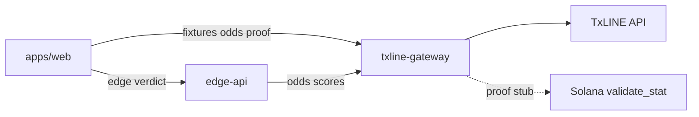

# 239 — Architecture: Prediction Markets & Settlement (microservices)

**Track:** TxODDS World Cup — Prediction Markets & Settlement  
**Deadline:** 2026-07-19  
**Product:** Natt Settlement (2D dashboard — no fan commentary, no 3D, no mobile)

---

## Services (3)

| Service | Role | Port (local) |
|---------|------|----------------|
| `apps/web` | Next.js 2D UI: fixtures, edge panel, settlement proof | 3000 |
| `services/txline-gateway` | TxLINE proxy + mock Merkle `/proof` | 4001 |
| `services/edge-api` | Shin consensus + logit combine + SETUP/HOLD | 4002 |

## Packages (2)

| Package | Role |
|---------|------|
| `packages/contracts` | Zod schemas: Fixture, OddsLine, ConsensusProbs, CombinedProb, EdgeVerdict, SettlementProof |
| `packages/natt-core` | Pure: `shin.ts`, `consensus.ts`, `combine.ts`, `natt_edge.ts` |

---

## Data flow



1. **Web** lists fixtures from gateway `GET /v1/fixtures`.
2. **Edge-api** pulls odds/scores from gateway, runs Shin + combine in `natt-core`, returns `MatchEdge`.
3. **Web** match page shows SETUP/HOLD + fetches `GET /v1/fixtures/:id/proof` for settlement UI.

---

## Edge math (internal doctrine)

- `pi_tx` = TxLINE consensus implied prob (Shin de-vig on 1x2 lines)
- `pi_model` = Natt private model on live features (stub; ML later)
- `logit(c) = alpha*log(pi_tx) + beta*log(pi_model)`
- **SETUP** only if `c - pi_tx > epsilon_net`; else **HOLD**

Constants in `packages/natt-core/src/config.ts` (pre-registered).

---

## Endpoints

### txline-gateway

| Method | Path | Description |
|--------|------|-------------|
| GET | `/health` | Service health |
| GET | `/v1/fixtures` | Fixture list |
| GET | `/v1/fixtures/:id/odds` | Odds lines |
| GET | `/v1/fixtures/:id/scores` | Live score snapshot |
| GET | `/v1/fixtures/:id/proof` | **Mock** Merkle settlement proof |
| POST | `/v1/txline/guest` | Guest JWT proxy |
| POST | `/v1/txline/activate` | apiToken activation |
| POST | `/v1/solana/rpc` | Solana RPC proxy |

### edge-api

| Method | Path | Description |
|--------|------|-------------|
| GET | `/health` | `{ service: "edge-api" }` |
| GET | `/v1/edge/:fixtureId` | Full `MatchEdge` payload |
| GET | `/v1/edge/:fixtureId/verdict` | `EdgeVerdict` only |

---

## Environment variables

| Variable | Service | Description |
|----------|---------|-------------|
| `TXLINE_API_TOKEN` | txline-gateway | TxLINE apiToken (VPS only) |
| `TXODDS_MOCK` | txline-gateway | `true` = fixture mocks |
| `CORS_ORIGIN` | gateway, edge-api | Web origin |
| `TXLINE_GATEWAY_URL` | edge-api | Internal gateway URL |
| `NEXT_PUBLIC_TXLINE_GATEWAY_URL` | web (build) | Public gateway base |
| `NEXT_PUBLIC_EDGE_API_URL` | web (build) | Public edge-api base |
| `NEXT_PUBLIC_BASE_PATH` | web (build) | e.g. `/fr/nattpundit` |
| `SOLANA_RPC_URL` | txline-gateway | RPC for activate flow |

---

## Explicit non-goals (jury)

- NO 3D / React Three Fiber / stadium assets
- NO fan commentary / pundit agent feed
- NO Expo mobile app
- NO betting execution — intelligence + settlement UX only

---

## Local commands

```bash
npm install
npm run build
npm test
npm run dev
# or
docker compose -f docker-compose.hackathon.yml up -d --build
```

Skill ref: nattapp-work-method (hackathon scope only — not Hypernatt prod).
